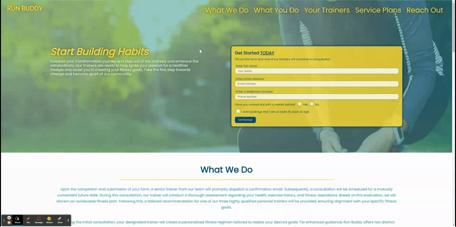

# Run Buddy Inc.
A website that offers fitness training services

:computer: **Live Deployment**: https://jwilferd10.github.io/run-buddy/

:computer: **Github Repository**: https://github.com/jwilferd10/run-buddy

## :open_file_folder: Table of Contents:
  - [Preview](#camera-preview)
  - [Demo](#movie_camera-demo)
  - [Description](#wave-description)
  - [User Story](#book-user-story)
  - [Resources Used](#floppy_disk-resources-used)
  - [Contributors](#paperclip-contributors)
  - [Contact Information](#e-mail-contact-information)

## :camera: Preview:

## :movie_camera: Demo:

## :wave: Description: 
This is the landing page of a fitness platform called Run Buddy, these pages showcase a fitness company that is promoting their platform and trying to sell their services as physical trainers. Built for both desktop and mobile devices. This is the companies digital footprint.

### 💭 Developer Notes
The foundational framework for Run Buddy was established at commit 6293801. Subsequent changes made beyond this commit are my personal updates. These commits are primarily aimed to modernize the platform. Notable improvements include:

- Replacement of lorem ipsum filler with detailed paragraphs 
- Evolution of the design, moving away from the 'boxed in' layout
- Strategic emphasis placed on key elements to capture user attention. 
- Animations for specific images
- Improved mobile experience

These enhancements enable Run Buddy to effectively engage with it's audience and learn more about the platform. 

### 🙏 Thank You
Especially for checking out Run Buddy, I consider this a stepping stone as it is the first landing page I've built.

## :book: User Story:
**AS A fitness corporation evaluating potential fitness partners**

- I WANT to understand the significance of Run Buddy's platform in the world of fitness and wellness,
    - SO THAT our own site is optimized for search engines

**GIVEN THAT our corporation is committed to promoting employee wellness and fitnes**
- WHEN I explore Run Buddy's platform and understand its purpose,
    - THEN I can make an informed decision on whether to engage with Run Buddy

## :floppy_disk: Resources Used:
- HTML
- CSS

## :paperclip: Contributors
- jwilferd10 (Mobile Setup, UX/UI Enhancements) 
  
## :e-mail: Contact Information:
- ### [jwilferd10](https://github.com/jwilferd10)
